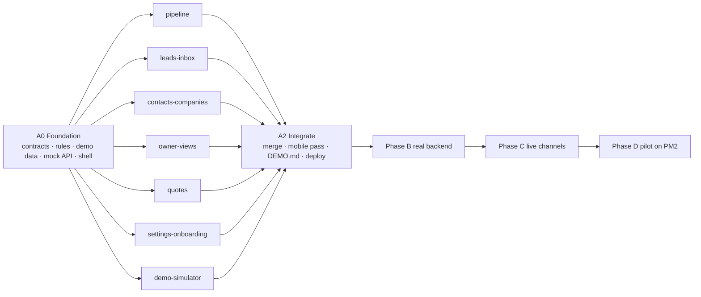

# HCO CRM — Plan

Source brief: [`docs/BRIEF.md`](docs/BRIEF.md). Vocabulary: [`CONTEXT.md`](CONTEXT.md). Decision register and rationale: the published blueprint page and `ARCHITECTURE.md` (Phase B).

The brief's waves are re-sequenced into four phases so the client sees the product first (decision R8, approved 2026-09-17).

| Phase                       | Goal                                                                                                                                                                                                                                                                                 | Status      |
| --------------------------- | ------------------------------------------------------------------------------------------------------------------------------------------------------------------------------------------------------------------------------------------------------------------------------------ | ----------- |
| **A — Client showcase**     | Every main screen, clickable on dummy data (a Dubai aesthetic & dental clinic), running on an in-browser mock of the real API contract. Free static hosting. No automated tests.                                                                                                     | In progress |
| **B — Real backend**        | Fastify API + worker, Postgres (Prisma 7), Redis/BullMQ, own session auth, tenant + role scoping, server-side Simulator. The web app switches `VITE_API_MODE=http`; screens are not rewritten. Tests return: core rules, cross-tenant isolation, milestone demo scripts (M0–M2, M5). | Next        |
| **C — Live channels**       | Meta setup check script, WhatsApp Cloud API, Meta Lead Ads, Gmail, TikTok stub; recorded fixtures first, then live. Signed webhook replay tests + manual live checklist (M3, M4, M6).                                                                                                | Later       |
| **D — Pilot on PM2 server** | Permissions end to end, CSV import on the real DB, onboarding, demo reset, mobile pass, load test (1,000 leads), deploy to the PM2 server (M7).                                                                                                                                      | Later       |

## Dependency graph

## Phase A build steps

1. **A0 Foundation (orchestrator, sequential)** — done:
   - monorepo (pnpm 11, Turborepo, TypeScript 6 strict, ESLint, Prettier)
   - `@hco/shared`: every entity, full REST contract, inbound/live events, adapter interfaces
   - `@hco/core`: lead/deal state machines, service window, stale rule, assignment, visibility, money/VAT, phone normalisation
   - `@hco/demo-data`: the clinic story
   - `apps/web`: React 19 + Vite 8 + TanStack Router/Query + Tailwind v4 + shadcn/ui, design tokens, app shell, per-tab sessions, in-browser mock backend (transactions, validation against the contract, live events across tabs, domain services)
2. **A1 Screens (7 parallel workstreams)** — see [`WAVE_A.md`](WAVE_A.md) for scope, owned files and definition of done.
3. **A2 Integrate and ship (orchestrator)**: merge branches, fix integration issues, mobile pass at 390px, `DEMO.md`, deploy to Cloudflare, hand over the URL.

Wall-clock estimates assume full parallelism: A1 is bounded by the slowest workstream (inbox, pipeline). A2 depends on merge conflicts and the mobile pass.
